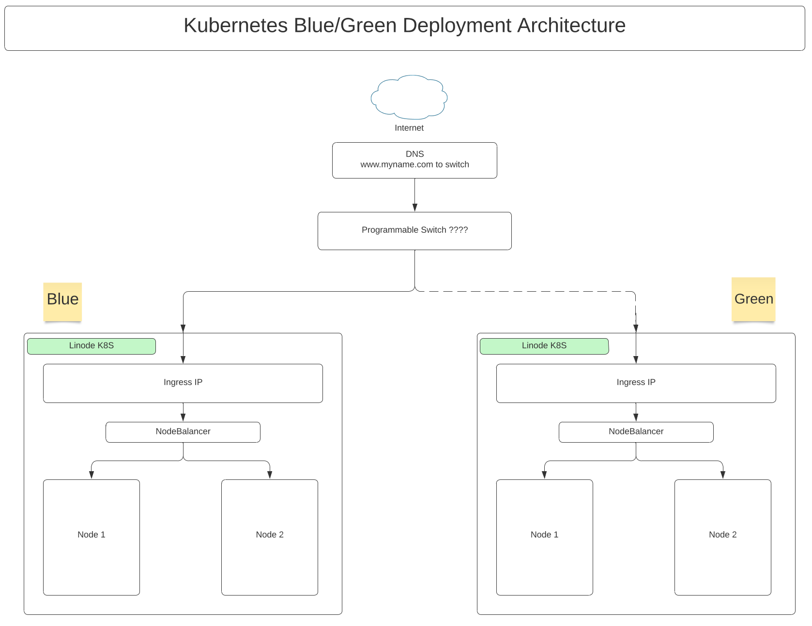

# blue-green-dreams

# Overview

A trivial web application (for now) whose deployment is fully automated 
via kubernetes and linode.  

"Blue Green Dreams" refers a) the dream of blue-green deployments of kubernetes clusters and b) the dream (present and future) of a deeply human and colorful reality.

It completely builds, deploys, tests and destroys a web application running on a k8s cluster.



# Development Environment
A make target will perform steps below (without pushing to dockerhub)

# Getting Started

## Environment variables 

The following environment variables are required:

* LINODE_CLI_TOKEN

* SSH_NGINX_LB_PRIVATE_KEY_B64

  This can be generated with `ssh-keygen -t ed25519 -f blue-green-keys -N ''`. And then base64 encode it with `base64 -w 0 < blue-green-keys` (`base64 -i blue-green-keys | tr -d '\n'` on Mac).

* SSH_NGINX_LB_PUBLIC_KEY

  This will be the contents of the `blue-green-keys.pub` file generated with the earlier `ssh-keygen -t ed25519 -f blue-green-keys -N ''`.

* NGINX_LB_ROOT_PASSWORD

  This will be the root password to the linode VM instance, this is requried to be set when creating an instance.

## Command examples

* ```$ make build```
* ```$ make build_deploy```
* ```$ make alias```
* cut-paste the alias command or place into .bashrc
* Ensure your API key is set: LINODE_CLI_TOKEN=f1bb76c659875deec37108a58xxxxx
* Try the following commands
  
* ```$ bgdctl deploy dev```
* ```$ bgdctl switch create dev```
* ```$ bgdctl switch delete dev```
* ```$ bgdctl switch-set-ip-target-to-cluster dev blue```
* ```$ bgdctl switch-set-ip-target-to-cluster dev green```
* ```$ bgdctl switch-set-ip-target-to-cluster prod blue```
* ```$ bgdctl switch-set-ip-target-to-cluster prod green```


